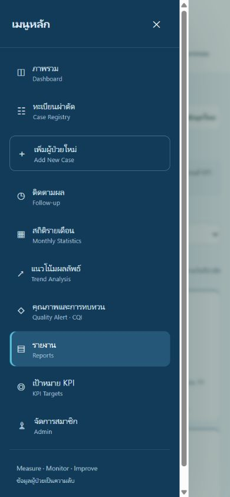
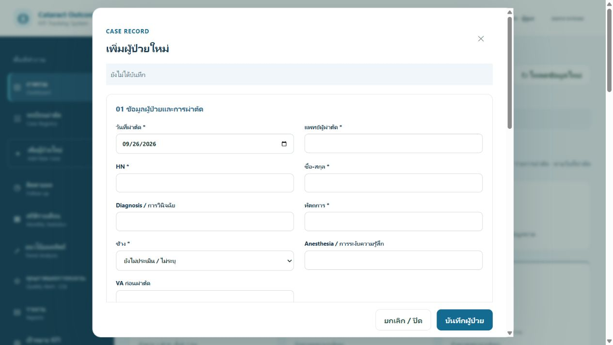
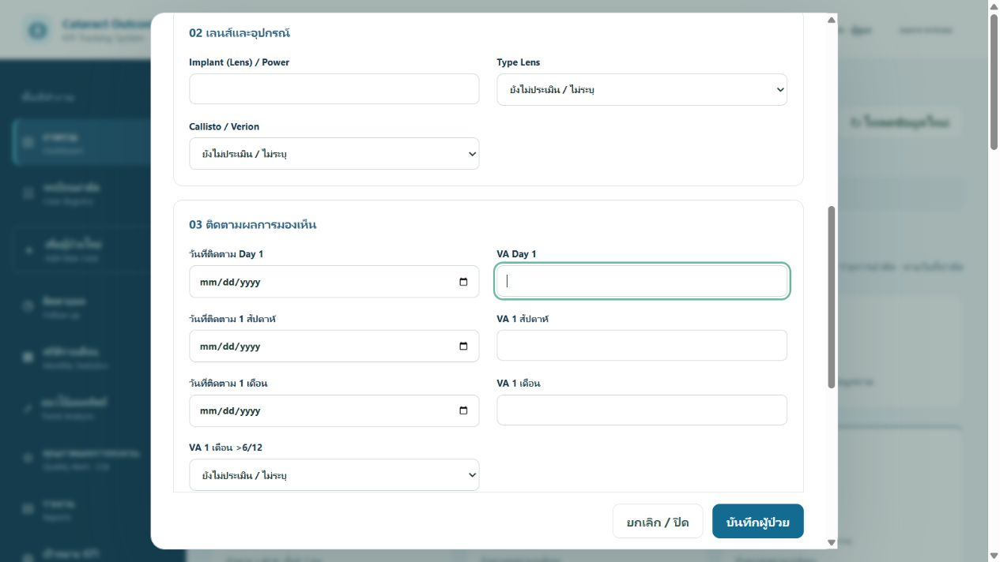
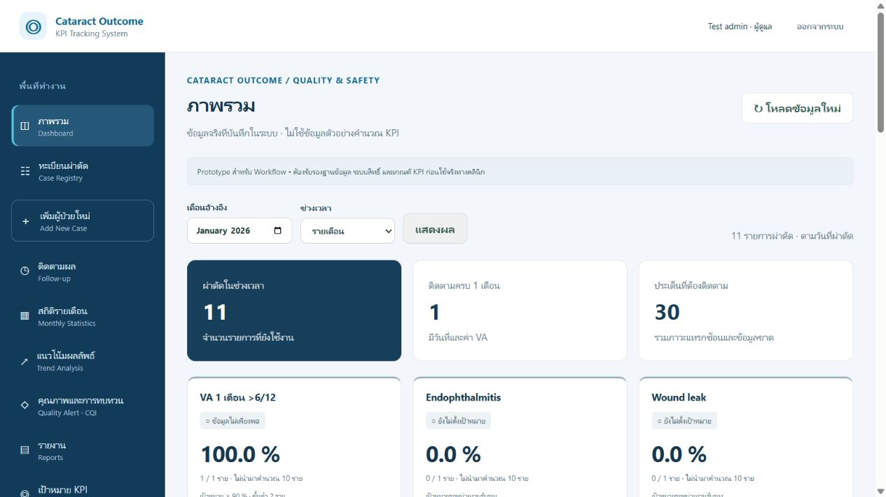
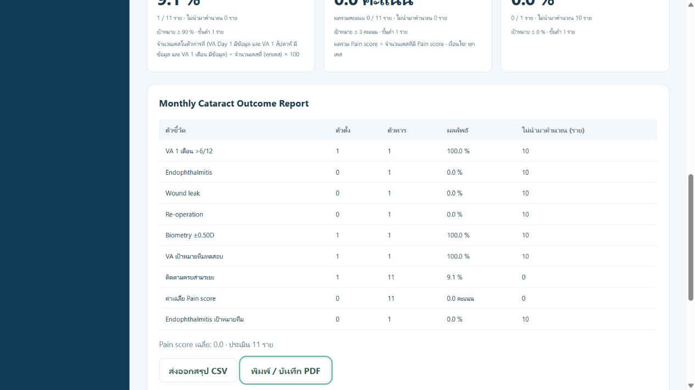
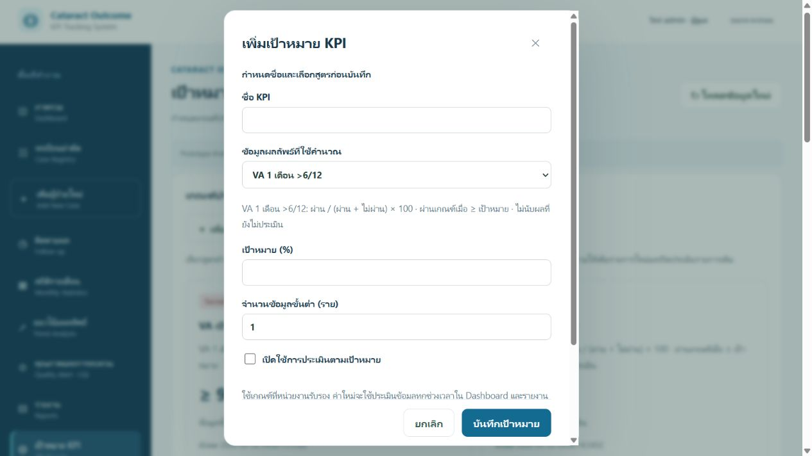

# คู่มือใช้งาน Cataract Outcome KPI Tracking System

สำหรับผู้ชม เจ้าหน้าที่ และผู้ดูแลแอป · ปรับปรุง 26 กันยายน 2569

ระบบใช้บันทึกรายการผ่าตัดต้อกระจก ติดตามผลหลังผ่าตัด และสรุปคุณภาพของทีม คู่มือนี้อ้างอิงหน้าจอและความสามารถปัจจุบัน หากยังไม่ได้ติดตั้ง ให้ผู้ดูแลเริ่มจาก [README](../README.md)

> ภาพทุกภาพมาจากระบบทดลองที่ใช้ฐานข้อมูลชั่วคราวและข้อมูลสมมติ ตัวเลข ชื่อ KPI เพิ่มเติม และเป้าหมายในภาพมีไว้สาธิต ไม่ใช่ผลการรักษาจริงหรือเกณฑ์ที่หน่วยงานรับรอง ระบบติดตั้งใหม่ไม่มีข้อมูลผู้ป่วย และยังไม่เปิดประเมินเป้าหมาย KPI อัตโนมัติ

## สารบัญ

- [เริ่มใช้งานและสิทธิ์](#start)
- [เมนูและช่วงเวลาของข้อมูล](#navigation)
- [เพิ่มรายการผ่าตัด](#new-case)
- [ค้นหา แก้ไข และติดตามผล](#followup)
- [อ่าน Dashboard และ KPI](#dashboard)
- [สถิติและแนวโน้ม](#statistics)
- [Quality Alerts และแผน CQI](#quality)
- [ส่งออกรายงาน](#reports)
- [ตั้งเป้าหมายและเพิ่ม KPI สำหรับ Admin](#targets)
- [จัดการสมาชิก ยกเลิกเคส และประวัติ](#admin)
- [ปัญหาที่พบบ่อย](#troubleshooting)
- [ขั้นตอนใช้งานประจำวันและสิ้นเดือน](#routine)

## 1. เริ่มใช้งานและสิทธิ์

1. เปิด URL ที่ผู้ดูแลแจ้ง หากใช้งานบนเครื่องที่เปิดเซิร์ฟเวอร์เอง ค่าเริ่มต้นคือ `http://127.0.0.1:8090/` ที่อยู่นี้ใช้กับเครื่องนั้นเท่านั้น
2. ใส่อีเมลและรหัสผ่าน **บัญชีแอป** แล้วกด **เข้าสู่ระบบ** บัญชี PocketBase superuser ใช้สำหรับดูแลระบบ ไม่ใช้เข้าหน้าแอป
3. หากยังไม่มีบัญชี เลือก **สมัครสมาชิก** กรอกชื่อที่แสดง อีเมล รหัสผ่านอย่างน้อย 8 ตัวอักษร และยืนยันรหัสผ่าน จากนั้นกด **สร้างบัญชี** แล้วกลับมาเข้าสู่ระบบ
4. บัญชีสมัครใหม่เป็น **ผู้ชม (viewer)** เสมอ หากต้องบันทึกข้อมูล ให้ติดต่อ Admin เพื่อกำหนดสิทธิ์
5. เมื่อเสร็จงาน กด **ออกจากระบบ** โดยเฉพาะเมื่อใช้เครื่องร่วมกัน

| งาน | ผู้ชม (viewer) | เจ้าหน้าที่ (editor) | ผู้ดูแล (admin) |
| --- | --- | --- | --- |
| ดู Dashboard สถิติ รายงาน และรายละเอียดเคส | ได้ โดยปกปิดชื่อ/HN และไม่แสดงบันทึกเพิ่มเติม | ได้ | ได้ |
| เพิ่ม/แก้ไขเคสและผลติดตาม | ไม่ได้ | ได้ | ได้ |
| เพิ่ม/แก้ไขแผน CQI | ไม่ได้ | ได้ | ได้ |
| ยกเลิก/คืนรายการผ่าตัด | ไม่ได้ | ไม่ได้ | ได้ |
| เพิ่ม/แก้เป้าหมาย KPI | ไม่ได้ | ไม่ได้ | ได้ |
| จัดการสมาชิกและดูประวัติการแก้ไข | ไม่ได้ | ไม่ได้ | ได้ |

สมาชิกใช้ข้อมูลของทีมเดียวกัน การปกปิดชื่อและ HN ของ viewer ไม่ได้ทำให้ข้อมูลทั้งหมดเป็นข้อมูลนิรนาม จึงควรให้สิทธิ์เฉพาะสมาชิกที่ได้รับอนุญาตจากหน่วยงาน

## 2. เมนูและช่วงเวลาของข้อมูล

คอมพิวเตอร์มีเมนูด้านซ้าย ส่วนมือถือแตะ **☰ เปิดเมนูหลัก** เพื่อเลือกหน้า เมื่อเลือกแล้วเมนูจะปิด สามารถปิดด้วย ✕ แตะพื้นที่นอกเมนู หรือกด Escape บนแป้นพิมพ์

*ภาพที่ 1 — เมนูมือถือในบัญชี Admin; บัญชีอื่นจะเห็นเมนูตามสิทธิ์*

ใช้ **เดือนอ้างอิง → ช่วงเวลา → แสดงผล** เพื่อเปลี่ยนช่วงข้อมูล:

| ช่วงเวลา | ข้อมูลที่ใช้ |
| --- | --- |
| รายเดือน | เดือนที่เลือก |
| รายไตรมาส | ไตรมาสปฏิทินที่มีเดือนที่เลือก เช่น เมษายนอยู่ในเมษายน–มิถุนายน |
| สะสมต้นปี (YTD) | มกราคมถึงเดือนที่เลือก |
| ทั้งปี / เทียบปีก่อน | ทั้งปีปฏิทินของเดือนที่เลือก; หน้าแนวโน้มใช้เทียบกับปีก่อน |

สถิติเลือกกลุ่มเคสตาม **วันที่ผ่าตัด** ไม่ใช่วันที่บันทึกหรือวันที่มาติดตาม เช่น ผ่าตัดเดือนมกราคมและติดตามเดือนกุมภาพันธ์ ผลนั้นยังเป็นของกลุ่มผ่าตัดเดือนมกราคม

ช่วงเวลานี้ใช้กับภาพรวม สถิติ การแจ้งเตือน และรายงาน ส่วน **ทะเบียนผ่าตัด/ติดตามผลแสดงรายการทุกช่วงเวลา** ตามคำค้นและตัวกรองของหน้านั้น แผน CQI แสดงเฉพาะเดือนอ้างอิง และกราฟแนวโน้มแสดงเดือนต่าง ๆ ของปีอ้างอิง

กด **โหลดข้อมูลใหม่** เมื่อต้องการดึงข้อมูลที่ทีมบันทึกเพิ่มเติม ควรบันทึกหรือจัดการการแก้ไขที่ค้างอยู่ก่อนโหลดใหม่

## 3. เพิ่มรายการผ่าตัด

สำหรับ editor และ admin: กด **เพิ่มผู้ป่วยใหม่ / Add New Case** หนึ่งรายการหมายถึงหนึ่งเหตุการณ์ผ่าตัด ไม่ใช่ประวัติผู้ป่วยตลอดชีวิต ผู้ป่วย HN เดิมมีหลายรายการได้เมื่อวันผ่าตัดหรือข้างต่างกัน

*ภาพที่ 2 — ช่องที่มีเครื่องหมาย * เป็นข้อมูลจำเป็น เลื่อนภายในฟอร์มเพื่อกรอกส่วนถัดไป*

### ส่วน 01 ข้อมูลผู้ป่วยและการผ่าตัด

กรอก **วันที่ผ่าตัด แพทย์ผู้ผ่าตัด HN ชื่อ-สกุล หัตถการ และข้าง** ให้ครบ เลือก OD (ขวา), OS (ซ้าย) หรือ OU (ทั้งสองข้าง) ตามรายการจริง วันที่ผ่าตัดต้องไม่เป็นอนาคต และระบบปัจจุบันไม่มีช่องเวลาผ่าตัด

กรอก Diagnosis / การวินิจฉัย, Anesthesia / การระงับความรู้สึก และ VA ก่อนผ่าตัดเมื่อมีข้อมูล ตรวจปีและรูปแบบวันที่ในตัวเลือกปฏิทิน เพราะหน้าตาอาจต่างกันตามภาษาเบราว์เซอร์

### ส่วน 02 เลนส์และอุปกรณ์

กรอก **Implant (Lens) / Power** แล้วเลือก **Type Lens** จากรายการที่รองรับ:

- Monofocal IOL / Monofocal Toric IOL
- Enhanced Monofocal IOL / Enhanced Monofocal Toric IOL
- EDOF IOL / EDOF Toric IOL
- Multifocal/Trifocal IOL / Multifocal/Trifocal Toric IOL

เลือก Callisto / Verion เป็น Callisto, Verion, ไม่ใช้ หรือยังไม่ระบุ หากรายการเก่าแสดง **ข้อมูลเดิม:** สามารถคงค่าเดิมไว้ได้ แต่เมื่อเปลี่ยนต้องเลือกค่าที่ระบบรองรับหรือไม่ระบุ

### ส่วน 03 ติดตามผลการมองเห็น

กรอกผลที่มีแล้วตามขั้นตอนใน [การติดตามผล](#followup) ส่วนที่ยังไม่มีผลให้เว้นว่าง ไม่จำเป็นต้องรอติดตามครบจึงบันทึกเคสครั้งแรก

### ส่วน 04 ผลลัพธ์และภาวะแทรกซ้อน

| ช่อง | วิธีบันทึก |
| --- | --- |
| Endophthalmitis, Wound leak, Re-operation | เลือก พบ / Yes หรือ ไม่พบ / No เมื่อประเมินแล้ว |
| Biometry Target ±0.50D, Post-op Refractive Error ±1.0D | เลือก ผ่าน / ไม่ผ่าน ตามผลประเมินของเจ้าหน้าที่ |
| Pain score 0–10 | จำนวนเต็ม 0 ถึง 10; เว้นว่างเมื่อยังไม่มีคะแนน |
| บันทึกเพิ่มเติม | บันทึกข้อมูลที่จำเป็นตามแนวทางของหน่วยงาน |

**ยังไม่ประเมิน / ไม่ระบุ ไม่เท่ากับ “ไม่พบ” หรือ “ผ่าน”** และ Pain score ว่างไม่เท่ากับ 0 ระบบไม่แปลงข้อความ VA หรือค่าเลนส์เป็นผลผ่าน/ไม่ผ่านให้อัตโนมัติ ผล Refractive ยังบันทึกได้ แต่ไม่อยู่ใน KPI หลัก 5 ตัว เว้นแต่ Admin เพิ่ม KPI ที่อ้างอิงผลนี้

### บันทึกและตรวจผล

1. ตรวจ HN วันที่ผ่าตัด และข้างให้ถูกต้อง แล้วกด **บันทึกผู้ป่วย**
2. รอข้อความ **บันทึกสำเร็จ • Dashboard และ KPI อัปเดตแล้ว** หากพบข้อผิดพลาด ข้อมูลยังไม่ถูกบันทึก ให้แก้ตามข้อความแล้วลองใหม่
3. เปิด **ทะเบียนผ่าตัด** ค้นหารายการ และตรวจรายละเอียดที่บันทึก

ระบบป้องกันรายการที่ยังใช้งานซ้ำด้วย **HN + วันที่ผ่าตัด + ข้าง** หากเป็นรายการเดิมให้แก้ไขรายการนั้น ไม่เพิ่มซ้ำ ตัวอักษรใน HN จะถูกปรับเป็นตัวพิมพ์ใหญ่

ฟอร์มแจ้งเมื่อมีการแก้ไขที่ยังไม่บันทึก หากปิดฟอร์มจะมีให้เลือกกลับไปแก้ไขหรือยืนยันยกเลิกการแก้ไข ระบบไม่มีการบันทึกอัตโนมัติหรือบันทึกแบบออฟไลน์

## 4. ค้นหา แก้ไข และติดตามผล

1. เปิด **ทะเบียนผ่าตัด** หรือ **ติดตามผล**
2. ใส่ HN ชื่อ หรือแพทย์ แล้วกด **ค้นหา** สำหรับ viewer ใช้รหัสเคสหรือแพทย์ตามช่องค้นหาที่แสดง
3. เลือกตัวกรอง **รายการที่ใช้งาน**, **ติดตามยังไม่ครบ** หรือ **ติดตามครบ** แล้วกด **ค้นหา** รายการแบ่งหน้าละ 10 รายการ
4. ดูป้าย D1 / W1 / M1 เพื่อทราบผลแต่ละระยะ จากนั้นกด **ดู / แก้ไข**; viewer ใช้ **ดูรายละเอียด** และแก้ไขไม่ได้
5. เลื่อนไปส่วน **03 ติดตามผลการมองเห็น** กรอกวันที่และ VA แล้วกด **บันทึกการแก้ไข**

*ภาพที่ 3 — แต่ละระยะต้องกรอกวันที่และค่า VA คู่กัน*

| ระยะ | ช่องที่ต้องกรอกคู่กัน |
| --- | --- |
| Day 1 (D1) | วันที่ติดตาม Day 1 + VA Day 1 |
| 1 สัปดาห์ (W1) | วันที่ติดตาม 1 สัปดาห์ + VA 1 สัปดาห์ |
| 1 เดือน (M1) | วันที่ติดตาม 1 เดือน + VA 1 เดือน |

วันที่ติดตามต้องอยู่ระหว่างวันผ่าตัดกับวันนี้ และระยะที่กรอกต้องเรียงตามลำดับ D1 ≤ W1 ≤ M1 เมื่อบันทึกผล **VA 1 เดือน >6/12** เป็นผ่านหรือไม่ผ่าน ต้องมีวันที่และ VA 1 เดือนก่อน โดยเจ้าหน้าที่เป็นผู้เลือกผลประเมิน

ตัวกรอง **ติดตามครบ** หมายถึงมี VA ครบทั้งสามระยะ ส่วนตัวเลข **ติดตามครบ 1 เดือน** บน Dashboard นับรายการที่มีผล 1 เดือน จึงอาจมีจำนวนต่างกัน

หากแจ้ง **ข้อมูลเปลี่ยนแปลงแล้ว กรุณาปิดฟอร์มและโหลดใหม่** แสดงว่ารายการถูกแก้ไขหลังจากคุณเปิดฟอร์ม ให้จดส่วนที่ต้องการแก้ไว้ในพื้นที่ทำงานที่หน่วยงานอนุญาต ปิดฟอร์ม โหลดข้อมูลใหม่ แล้วเปิดรายการล่าสุดเพื่อตรวจและแก้อีกครั้ง

## 5. อ่าน Dashboard และ KPI

*ภาพที่ 4 — เลือกช่วงเวลาก่อนอ่านผล; ตัวเลขและเป้าหมายในภาพเป็นข้อมูลทดสอบ*

ด้านบนแสดงจำนวนรายการผ่าตัดที่ยังใช้งาน จำนวนที่มีผลติดตาม 1 เดือน และจำนวนประเด็นที่ต้องติดตาม หนึ่งเคสมีหลายประเด็นได้ จึงไม่ควรอ่านจำนวนประเด็นเป็นจำนวนผู้ป่วย

KPI หลักมี 5 ตัว ได้แก่ VA 1 เดือน >6/12, Endophthalmitis, Wound leak, Re-operation และ Biometry ±0.50D การ์ดเพิ่มเติมมาจาก KPI ที่ Admin สร้าง

| ข้อมูลบนการ์ด | ความหมาย |
| --- | --- |
| ผลลัพธ์ (%) | ตัวตั้ง ÷ ตัวหาร × 100 |
| VA / Biometry | ตัวตั้งคือจำนวนผ่าน; ตัวหารคือผ่าน + ไม่ผ่าน |
| ภาวะแทรกซ้อน 3 ตัว | ตัวตั้งคือจำนวนพบ; ตัวหารคือพบ + ไม่พบ |
| ไม่นำมาคำนวณ … ราย | เคสในช่วงที่เลือกซึ่งไม่เข้าในการคำนวณ เช่น ยังไม่ประเมิน หรือไม่ผ่านเงื่อนไขสูตร Custom |
| N/A | ไม่มีตัวหาร จึงยังคำนวณผลไม่ได้ ไม่ใช่ 0% |
| ข้อมูลไม่เพียงพอ | จำนวนข้อมูลที่นำมาคำนวณยังไม่ถึงขั้นต่ำ จึงยังไม่ตัดสินผ่านเป้าหมาย |
| ยังไม่ตั้งเป้าหมาย | ยังไม่เปิดใช้การประเมินเป้าหมาย แม้มีผลลัพธ์จริงแสดงอยู่ |
| ผ่าน / ไม่ผ่านเป้าหมาย | เปรียบเทียบผลกับเกณฑ์และทิศทางที่ Admin เปิดใช้ เมื่อข้อมูลถึงขั้นต่ำ |

ตัวอย่างสมมติ: ผ่าตัด 10 รายการ มี VA ผ่าน 6 ไม่ผ่าน 2 และยังไม่ประเมิน 2 ผลคือ **6 ÷ 8 × 100 = 75%** และไม่นำมาคำนวณ 2 ราย ไม่ใช่ 6 ÷ 10

หน่วยนับเป็น **รายการผ่าตัด** แม้เลือก OU ก็ยังนับหนึ่งรายการ เคสที่ยกเลิกไม่รวม KPI ค่าเฉลี่ย Pain score รวมเฉพาะรายการที่มีคะแนน โดยนับคะแนน 0 ด้วย

อ่านส่วน **ความครบถ้วนของข้อมูล** ควบคู่กับเปอร์เซ็นต์เสมอ เช่น ผลผ่าน 100% จากข้อมูลเพียง 1 รายไม่ได้หมายความว่าทุกรายได้รับการประเมินแล้ว

## 6. สถิติและแนวโน้ม

- **สถิติรายเดือน:** เลือกเดือนและช่วงเวลาแล้วกดแสดงผล ดูตารางตัวตั้ง ตัวหาร ผลลัพธ์ และจำนวนที่ไม่นำมาคำนวณ ใช้ช่วงรายไตรมาส/YTD/ทั้งปีได้ด้วย
- **แนวโน้มผลลัพธ์:** ดูจำนวนผ่าตัดรายเดือนและ VA ผ่าน/ประเมินของปีอ้างอิง พร้อมการเปรียบเทียบทั้งปีที่เลือกกับปีก่อน การเทียบปีไม่ใช่การเทียบ YTD ช่วงเดียวกัน
- ตารางหรือกราฟที่เป็น N/A หมายถึงไม่มีผลประเมินให้คำนวณในช่วงนั้น

หากบันทึกผลติดตามเพิ่มเติมหรือเปลี่ยนเป้าหมาย KPI ภายหลัง รายงานย้อนหลังอาจเปลี่ยนตามข้อมูลและเกณฑ์ล่าสุด ระบบไม่มีเกณฑ์แยกตามวันที่เริ่มใช้

## 7. Quality Alerts และแผน CQI

เปิด **คุณภาพและการทบทวน** แล้วเลือกช่วงเวลาที่ต้องการตรวจ การแจ้งเตือนสร้างจากเคสที่บันทึกอยู่:

| ระดับ | เงื่อนไขในระบบ |
| --- | --- |
| Critical | บันทึก Endophthalmitis เป็นพบ |
| High | บันทึก Wound leak หรือ Re-operation เป็นพบ |
| Monitor | ผล VA 1 เดือนไม่ผ่าน หรือยังไม่มีผลติดตามเมื่อผ่านวันผ่าตัดมาแล้ว 1 / 7 / 30 วันตามระยะ |

กด **ดูเคส** เพื่อตรวจข้อมูลต้นทางและบันทึกผลที่มีจริง การแจ้งเตือนไม่มีปุ่มรับทราบแยกหรือระบบส่งแจ้งเตือนเบื้องหลัง และไม่ใช่ระบบแจ้งเหตุฉุกเฉินหรือคำแนะนำการรักษา

สำหรับ editor/admin ที่ต้องบันทึกแผนปรับปรุง:

1. เลือกเดือนอ้างอิงที่ต้องการทบทวน แล้วกด **เพิ่มแผนปรับปรุง**
2. กรอกเดือนทบทวน วันครบกำหนด ประเด็นทบทวน และผู้รับผิดชอบ
3. เลือกขั้นตอน **Plan** (วางแผน), **Do** (ดำเนินการ), **Check** (ตรวจผล) หรือ **Act** (ปรับปรุงมาตรฐาน)
4. เขียนแผนหรือผลทบทวนโดยไม่ระบุข้อมูลผู้ป่วย แล้วกด **บันทึกแผน**
5. กลับมาเลือกเดือนเดียวกันและกด **เปิดแผน** เพื่อแก้ไขความคืบหน้า

แผนแสดงตามเดือนทบทวนตรงกับเดือนอ้างอิง แม้เลือกช่วงรายไตรมาสก็ตาม ควรประสานผู้แก้ไขแผนเดียวกัน เพราะแผน CQI ใช้ข้อมูลที่บันทึกล่าสุด และไม่มีการตรวจฉบับชนกันแบบเคส

## 8. ส่งออกรายงาน

1. เปิด **รายงาน** เลือกเดือนอ้างอิงและช่วงเวลา แล้วกด **แสดงผล**
2. ตรวจจำนวนข้อมูล ตัวตั้ง ตัวหาร และค่า N/A ก่อนส่งออก
3. เลื่อนลงใต้ตาราง **Monthly Cataract Outcome Report** แล้วเลือกวิธีส่งออก

*ภาพที่ 5 — ปุ่มส่งออกอยู่ใต้ตารางสรุปผล*

| ปุ่ม | ผลที่ได้ |
| --- | --- |
| ส่งออกสรุป CSV | ไฟล์สถิติรวมของช่วงที่เลือก เปิดด้วยโปรแกรมตารางคำนวณได้; ชื่อไฟล์มีเดือนและชนิดช่วงเวลา |
| พิมพ์ / บันทึก PDF | เปิดหน้าพิมพ์ของเบราว์เซอร์ เลือกเครื่องพิมพ์หรือ Save as PDF/บันทึกเป็น PDF แล้วตรวจตัวอย่างก่อนบันทึก |

รายงานไม่ส่งออกรายชื่อผู้ป่วยหรือ HN ไฟล์ CSV เป็นตารางสรุป KPI ไม่ใช่สำเนาทุกส่วนของหน้าจอ และ **ไม่ใช่ไฟล์สำรองฐานข้อมูล** การสำรอง/กู้คืนให้ผู้ดูแลระบบดำเนินการผ่าน PocketBase ตามกระบวนการของหน่วยงาน

## 9. ตั้งเป้าหมายและเพิ่ม KPI สำหรับ Admin

### ปรับเกณฑ์ของ KPI ที่มีอยู่

1. เปิด **เป้าหมาย KPI** แล้วเลือกแก้ไขรายการที่ต้องการ
2. กำหนด **เป้าหมาย** และ **จำนวนข้อมูลขั้นต่ำ (ราย)** ตามเกณฑ์ที่หน่วยงานรับรอง
3. เลือก **เปิดใช้การประเมินตามเป้าหมาย** หากพร้อมใช้ตัดสินผล แล้วกด **บันทึกเป้าหมาย**

ค่าเป้าหมายร้อยละอยู่ในช่วง 0–100 และค่าเฉลี่ย Pain score อยู่ในช่วง 0–10 จำนวนขั้นต่ำเป็นจำนวนเต็มอย่างน้อย 1 หากปิดประเมิน ระบบยังแสดงผลจริงแต่ไม่ตัดสินผ่าน/ไม่ผ่าน

### เพิ่ม KPI ด้วยสูตรสำเร็จรูป

1. กด **เพิ่มเป้าหมาย KPI** ตั้งชื่อใหม่ที่ไม่ซ้ำ
2. เลือกแหล่งผลลัพธ์ เช่น VA, Biometry หรือภาวะแทรกซ้อน แล้วอ่านคำอธิบายสูตรและทิศทาง
3. กรอกเป้าหมาย จำนวนขั้นต่ำ และสถานะเปิดประเมิน ก่อนกด **บันทึกเป้าหมาย**

*ภาพที่ 6 — ตรวจชื่อ สูตร และเกณฑ์ก่อนบันทึก; KPI ใหม่เริ่มต้นปิดประเมิน*

### ตัวอย่างสูตร “ติดตามครบสามระยะ ÷ ผ่าตัดทั้งหมด”

1. เพิ่ม KPI ใหม่ ตั้งชื่อที่สื่อความหมาย แล้วเลือก **กำหนดสูตรเอง**
2. เลือกประเภท **ร้อยละ: ตัวตั้ง ÷ ตัวหาร × 100**
3. ให้กลุ่ม **ตัวหาร** ไม่มีเงื่อนไข ซึ่งหมายถึงทุกเคสในช่วงที่เลือกและยังใช้งาน
4. ในกลุ่ม **ตัวตั้ง** เลือกให้ตรงทุกเงื่อนไข (AND) และเพิ่ม VA Day 1 มีข้อมูล, VA 1 สัปดาห์มีข้อมูล และ VA 1 เดือนมีข้อมูล
5. เลือกทิศทาง **มากกว่าหรือเท่ากับเป้าหมาย (≥)** แล้วกำหนดเป้าหมายและจำนวนขั้นต่ำที่รับรองแล้ว
6. อ่านตัวอย่างผลจากข้อมูลที่บันทึกในช่วงอ้างอิง ตรวจสูตร จากนั้นบันทึก

กลุ่มเงื่อนไขเลือก AND/OR ได้กลุ่มละไม่เกิน 10 ข้อ รองรับผลประเมิน ข้างที่ผ่าตัด การมี/ไม่มี VA และตัวเปรียบเทียบ Pain score ตัวตั้งนับเฉพาะเคสที่อยู่ในตัวหารอยู่แล้ว หากไม่มีตัวหารแสดง N/A

อีกประเภทคือ **ค่าเฉลี่ย Pain score (0–10)** ใช้ผลรวมคะแนนหารด้วยจำนวนเคสที่มีคะแนนในกลุ่มเงื่อนไข ค่าว่างไม่รวม แต่คะแนนศูนย์รวม สูตร Custom ใช้ตัวเลือกที่ระบบรองรับ ไม่รับสูตร JavaScript, SQL หรือสมการอิสระ

**หลังสร้างแล้วเปลี่ยนชื่อ แหล่งข้อมูล สูตร และทิศทางไม่ได้** หากเปลี่ยนนิยามให้เพิ่ม KPI ชื่อใหม่และปิดประเมินรายการเดิม ไม่มีปุ่มลบถาวร ค่าเป้าหมาย/จำนวนขั้นต่ำ/สถานะยังแก้ได้ และใช้กับทุกช่วงเวลารวมถึงย้อนหลัง ฟอร์มแก้ไขแสดงประวัติล่าสุด 20 รายการ ควรประสานงานก่อนแก้ KPI เดียวกันพร้อมกัน

## 10. จัดการสมาชิก ยกเลิกเคส และประวัติ

### จัดการสมาชิก

Admin เปิด **จัดการสมาชิก → แก้ไขสมาชิก** ปรับชื่อที่แสดง สิทธิ์ และสถานะ **เปิดใช้งานบัญชี** แล้วกด **บันทึกสมาชิก** ระบบไม่เปิดให้แก้บัญชีตัวเองในหน้านี้ และไม่ได้ใช้หน้านี้เปลี่ยนอีเมลหรือรหัสผ่าน

เมื่อเปลี่ยนสิทธิ์หรือปิดบัญชี การเรียก API จะตรวจสถานะปัจจุบัน แต่หน้าจอที่เปิดไว้แล้วอาจยังแสดงข้อมูลเดิมจนโหลดใหม่หรือออกจากระบบ ให้สมาชิกโหลดหน้าใหม่หลังเปลี่ยนสิทธิ์

### ยกเลิกและคืนรายการ

1. ค้นหาเคสใน **ทะเบียนผ่าตัด** กด **ยกเลิกรายการ** และยืนยัน รายการยังถูกเก็บไว้ แต่ไม่นำไปคำนวณ KPI
2. หากต้องคืน ให้เลือกตัวกรอง **รายการที่ยกเลิก** แล้วกด **ค้นหา** จากนั้นกด **คืนรายการ** และยืนยัน
3. รายการที่ยกเลิกเปิดดูได้ แต่แก้ไขไม่ได้จนกว่าจะคืนรายการ ระบบตรวจรายการซ้ำอีกครั้งตอนคืน

ปุ่ม **ยกเลิก / ปิด** ในฟอร์มใช้ปิดฟอร์มหรือทิ้งการแก้ไขที่ยังไม่บันทึก ซึ่งต่างจาก **ยกเลิกรายการ** ในทะเบียน

### ดูประวัติการแก้ไขเคส

เปิดเคสแล้วกด **ดูประวัติการแก้ไข** เพื่อดูเวลา ผู้แก้ไข และชื่อช่องที่เปลี่ยนล่าสุดไม่เกิน 100 รายการ ข้อมูลผู้สร้าง/ผู้แก้ไขบางจุดแสดงเป็นรหัสบัญชี ประวัตินี้ไม่ได้ครอบคลุมทุกการเปิดดูหรือส่งออกรายงาน

## 11. ปัญหาที่พบบ่อย

| อาการ | วิธีตรวจและแก้ |
| --- | --- |
| เข้าเว็บไซต์ไม่ได้ | ตรวจ URL/เครือข่าย และให้ผู้ดูแลตรวจว่าเซิร์ฟเวอร์เปิดอยู่; localhost ต้องเปิดบนเครื่องเซิร์ฟเวอร์เอง |
| เข้าสู่ระบบไม่ได้ | ตรวจอีเมล รหัสผ่าน และสถานะบัญชีกับ Admin; หน้าแอปไม่มีขั้นตอนกู้รหัสผ่านด้วยอีเมล |
| ไม่เห็นปุ่มเพิ่ม/แก้ไข หรือเมนูผู้ดูแล | ตรวจบทบาท ผู้สมัครใหม่เป็น viewer; หลังปรับสิทธิ์ให้โหลดหน้าใหม่ |
| มีเคสในทะเบียน แต่ Dashboard ว่าง | ตรวจเดือน/ช่วงเวลาและวันที่ผ่าตัดของเคส รวมถึงสถานะยกเลิก |
| KPI เป็น N/A หรือข้อมูลไม่เพียงพอ | ตรวจว่ากรอกผลประเมินแล้วหรือไม่ และตัวหารถึงจำนวนขั้นต่ำหรือยัง |
| กรอก VA แล้วแต่บันทึกไม่ได้ | กรอกวันที่คู่กับ VA ตรวจวันไม่เป็นอนาคตและเรียงลำดับ; ผลผ่าน/ไม่ผ่าน VA 1 เดือนต้องมีผลติดตาม 1 เดือน |
| รายการซ้ำหรือคืนรายการไม่ได้ | ค้นหา HN วันผ่าตัด และข้างเดียวกันในรายการที่ใช้งาน แล้วให้ Admin ตรวจรายการที่ควรเก็บ |
| ข้อมูลเปลี่ยนแปลงแล้ว | ปิดฟอร์ม โหลดข้อมูลใหม่ แล้วเปิดเคสล่าสุดก่อนแก้ ไม่กดบันทึกฉบับเก่าซ้ำ |
| ไม่พบแผน CQI | เลือกเดือนอ้างอิงให้ตรงกับเดือนทบทวนที่บันทึก |
| บันทึกไม่สำเร็จ/เครือข่ายขัดข้อง | อ่านข้อความผิดพลาดและตรวจการเชื่อมต่อ; หากไม่แน่ใจว่าบันทึกถึงเซิร์ฟเวอร์แล้วหรือไม่ ให้ค้นหารายการก่อนเพิ่มซ้ำ |
| CSV เปิดแล้วภาษาไทยผิด | ใช้เมนูนำเข้าข้อความของโปรแกรมตารางคำนวณและเลือก UTF-8; ไม่ใช่การนำเข้าข้อมูลกลับเข้าแอป |

ระบบไม่มีหน้า Data Import, Master Data, Settings หรือ KPI Monitoring แยกต่างหาก และยังไม่มีการนำเข้า Excel/CSV ผ่านหน้าแอป

## 12. ขั้นตอนใช้งานประจำวันและสิ้นเดือน

**ประจำวัน:** เข้าระบบ → ค้นหาเคสเดิมก่อนเพิ่ม → บันทึกการผ่าตัด/ผลติดตาม → ตรวจข้อความบันทึกสำเร็จ → ตรวจรายการติดตามยังไม่ครบและ Quality Alerts → ออกจากระบบ

**สิ้นเดือน:** เลือกช่วงตามวันที่ผ่าตัด → ตรวจความครบถ้วนและตัวหาร → ทบทวนผลตามเกณฑ์ที่รับรอง → บันทึกแผน CQI ของเดือนนั้น → ตรวจและส่งออกสถิติรวม

ระบบเป็น Prototype สำหรับทดสอบ Workflow ต้องผ่านการรับรองฐานข้อมูล สิทธิ์ และนิยาม KPI ของหน่วยงานก่อนใช้จริงทางคลินิก รายละเอียดสำหรับผู้ดูแลและผู้พัฒนาอยู่ใน [สถาปัตยกรรม](ARCHITECTURE.md), [ขอบเขตความปลอดภัย](SECURITY.md) และ [บันทึกส่งมอบ](HANDOFF.md)
